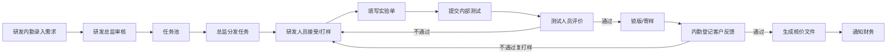

# 研发样品管理系统 · 角色权限细则

> 依据主流程（RND-003）与角色边界（RND-002）整理。  
> 实现位置：后端 `RolePermissionService`（API 拦截）+ 前端 `packages/shared/src/permissions`（菜单/路由/按钮）。

## 一、主流程与责任角色

| 阶段 | 业务动作 | 责任角色 | 禁止角色 |
|------|----------|----------|----------|
| 1 需求录入 | 创建/编辑/提交样品需求 | 研发内勤 `RND_ASSISTANT` | 研发人员、测试、财务 |
| 2 需求审核 | 审核通过 / 退回补充 | 研发总监 `RND_DIRECTOR` | **内勤、研发、测试、财务** |
| 3 任务池 | 查看待分发任务 | 研发总监、管理层 `MANAGER` | 内勤、研发、测试 |
| 4 任务分发 | 指定研发人员、截止日期 | 研发总监 | **内勤、研发、测试** |
| 5 接受任务 | 确认接单 | 被分发的研发人员 `RND_ENGINEER` | 内勤、测试 |
| 6 打样实验单 | 保存草稿、上传附件 | 被分发的研发人员（总监可代打样） | 内勤、测试、财务 |
| 6b 通知测试 | 实验单草稿提交内部测试 | 研发人员、总监、**研发内勤** | 测试、财务 |
| 7 内部测试 | 通过 / 不通过复打样 | 测试人员 `TESTER` / `QA_TESTER` | **内勤、研发改实验单** |
| 8 寄样 | 登记寄样信息 | 研发内勤 | 研发、测试 |
| 9 客户反馈 | 登记通过/不通过/复打样 | 研发内勤 | 研发、测试 |
| 10 核价 | 生成核价文件、下载 | 研发内勤 | 研发、测试 |
| 11 通知财务 | 处理核价通知 | 财务 `FINANCE`、内勤发起 | 研发、测试 |
| 12 停止/归档 | 查看停止池、归档文件 | 内勤、总监、管理层 | 研发默认不看停止池 |
| 13 系统设置 | 人员、权限、表单、流程配置 | 管理员 `ADMIN` | 全部业务角色 |

---

## 二、角色一览

| 角色编码 | 名称 | 定位 |
|----------|------|------|
| `RND_ASSISTANT` | 研发内勤 | 需求录入、寄样、客户反馈、核价发起 |
| `RND_DIRECTOR` | 研发总监 | 审核、分发、全局查看；可亲自打样 |
| `RND_ENGINEER` | 研发人员 | 接受任务、实验单、提交测试 |
| `TESTER` / `QA_TESTER` | 测试人员 | 内部测试评价 |
| `FINANCE` | 财务 | 核价文件查看与确认 |
| `MANAGER` | 管理层 | 只读查看各模块进度 |
| `ADMIN` / `SYSTEM_ADMIN` | 管理员 | 全部功能 + 系统设置 |

---

## 三、PC 菜单与页面权限

| 菜单/页面 | 路径 | 允许角色 |
|-----------|------|----------|
| 工作台 | `/dashboard` | 全部业务角色 + 管理员 |
| 录入需求 | `/demand/new` | 内勤、总监、管理员 |
| 需求审核 | `/demand/review` | **仅总监、管理层、管理员** |
| 我的打样任务 | `/rnd/my-tasks` | 研发、总监、管理员 |
| 内部测试待办 | `/rnd/pending-tests` | 测试、管理员 |
| 任务池 | `/rnd/pool` | 总监、管理层、管理员 |
| 任务分发 | `/rnd/assign` | **仅总监、管理员** |
| 任务详情/实验单 | `/rnd/tasks/:id` | 总监、研发、测试、管理层、管理员 |
| 实验单编辑 | `/rnd/tasks/:id/experiment` | 研发、总监、管理员 |
| 内部测试页 | `/rnd/tasks/:id/test` | 测试、管理员 |
| 寄样反馈 | `/shipment/list` | 内勤、总监、管理层、管理员 |
| 核价文件 | `/pricing/list` | 内勤、总监、财务、管理层、管理员 |
| 停止项目池 | `/rnd/stopped` | 内勤、总监、管理层、管理员 |
| 系统设置 | `/settings/**` | **仅管理员** |

无权限访问页面时：跳转 **403** 页面。

---

## 四、手机端入口权限

| 入口 | 路径 | 允许角色 |
|------|------|----------|
| 我的待办 | `/todo` | 全部业务角色 |
| 录入需求 | `/request/new` | 内勤、总监、管理员 |
| 审核需求 | `/requests/review` | **仅总监、管理层、管理员** |
| 分配任务 | `/tasks/assign` | **仅总监、管理员** |
| 样品/打样列表 | `/samples` | 研发、总监、财务、管理层、管理员 |
| 内部测试 | `/tests/:id` | 测试、管理员 |
| 寄样反馈 | `/shipments/:id` | 内勤、总监、管理层、管理员 |
| 实验单（查看/通知测试） | `/experiments/:id` | 研发、总监、**内勤**、管理员 |

---

## 五、按钮级权限（前端 `canPerformAction`）

| 动作编码 | 说明 | 允许角色 |
|----------|------|----------|
| `APPROVE_REQUEST` | 审核通过需求 | 总监、管理层、管理员 |
| `ASSIGN_TASK` | 分发研发任务 | 总监、管理员 |
| `ACCEPT_TASK` | 接受任务 | 研发、总监、管理员 |
| `SAVE_EXPERIMENT` | 保存实验单草稿 | 研发、总监、管理员 |
| `NOTIFY_INTERNAL_TEST` | 通知内部测试（提交实验单） | 研发、总监、**内勤**、管理员 |
| `PERFORM_INTERNAL_TEST` | 测试通过/不通过 | 测试、管理员 |
| `RECORD_SHIPMENT_FEEDBACK` | 登记寄样/客户反馈 | 内勤、总监、管理员 |
| `MANAGE_SETTINGS` | 系统配置 | 管理员 |

任务详情内操作还受 **数据范围** 约束：研发只能操作 `assigneeName == 本人姓名` 的任务（后端 `detailActions` + `canOperateTask`）。

---

## 六、API 接口权限（后端拦截）

越权调用返回 `403 SESSION_ROLE_FORBIDDEN`。

### 研发内勤 `RND_ASSISTANT`

| 方法 | 路径 | 说明 |
|------|------|------|
| POST | `/sample-requests` | 创建需求 |
| GET | `/sample-requests` | 需求列表 |
| GET | `/dashboard/overview` | 工作台 |
| GET | `/rnd-tasks` | 待办任务（含打样中，用于通知测试） |
| GET | `/rnd-tasks/*/detail` | 任务详情 |
| POST | `/experiment-forms/*/submit-test` | **通知内部测试** |
| POST | `/sample-versions/*/shipments` | 登记寄样 |
| POST | `/shipments/*/feedback` | 客户反馈 |
| POST | `/sample-versions/*/pricing-files` | 生成核价 |
| GET | `/pricing-files` | 核价列表 |
| GET | `/sample-projects/stopped` | 停止池 |

**明确禁止**：`POST /sample-requests/*/approve`、`POST /rnd-tasks/*/assign`

### 研发总监 `RND_DIRECTOR`

| 方法 | 路径 | 说明 |
|------|------|------|
| POST | `/sample-requests/*/approve` | 审核需求 |
| GET | `/rnd-tasks/pool` | 任务池 |
| POST | `/rnd-tasks/*/assign` | 分发任务 |
| GET/POST | 研发任务、实验单相关 | 同研发人员 |

### 研发人员 `RND_ENGINEER`

| 方法 | 路径 | 说明 |
|------|------|------|
| GET | `/rnd-tasks` | 任务列表（默认仅本人） |
| POST | `/rnd-tasks/*/accept` | 接受任务 |
| POST | `/rnd-tasks/*/experiment-form/draft` | 实验单草稿 |
| POST | `/experiment-forms/*/submit-test` | 提交内部测试 |

**明确禁止**：审核、分发、寄样、核价生成

### 测试人员 `TESTER` / `QA_TESTER`

| 方法 | 路径 | 说明 |
|------|------|------|
| GET | `/rnd-tasks` | 待测任务列表 |
| GET | `/rnd-tasks/*/detail` | 任务详情 |
| POST | `/test-assignments/*/pass` | 测试通过 |
| POST | `/test-assignments/*/fail-resample` | 不通过复打样 |

### 财务 `FINANCE`

| 方法 | 路径 | 说明 |
|------|------|------|
| GET | `/pricing-files` | 核价列表 |
| GET | `/pricing-files/*/detail` | 核价详情 |
| POST | `/pricing-files/*/notify-finance` | 确认通知 |

---

## 七、数据范围规则

| 数据 | 规则 |
|------|------|
| 我的打样任务 | `assigneeName = 当前登录人姓名`；研发角色列表 API 默认过滤 |
| 任务池 | 状态为 `PENDING_ASSIGNMENT` 的未分发任务 |
| 内部测试待办 | 状态为 `PENDING_TEST` 的任务 |
| 停止项目池 | 内勤/总监/管理层可见；研发默认不可见 |
| 历史版本 | 只读查看，不可覆盖锁版后数据 |

---

## 八、演示账号（MOCK）

| 姓名 | feishuUserId | 角色 |
|------|--------------|------|
| 赵内勤 | `ou_demo_assistant` | RND_ASSISTANT |
| 赵总监 | `ou_demo_director` | RND_DIRECTOR |
| 张研发 | `ou_demo_engineer` | RND_ENGINEER |
| 李测试 | `ou_demo_tester` | TESTER |
| 钱财务 | `ou_demo_finance` | FINANCE |

---

## 九、已知限制（当前版本）

1. **菜单权限**由前端内置矩阵控制；设置页「角色权限」仅配置 **API 规则**，二者需同步维护。
2. `role_permission` 表有数据时以数据库为准；空表时回退代码内置默认矩阵。
3. 管理层 `MANAGER` 可进审核页但无审核 API 权限（只读监督场景）。

---

## 十、变更记录

| 日期 | 说明 |
|------|------|
| 2026-06-28 | 首版：对齐 RND-002/047/048；修复内勤误进审核、测试无任务列表、工作台 API 403 |
| 2026-06-28 | 内勤开放待寄样反馈待办、通知内部测试；待办 Hero 优先展示寄样反馈 |
